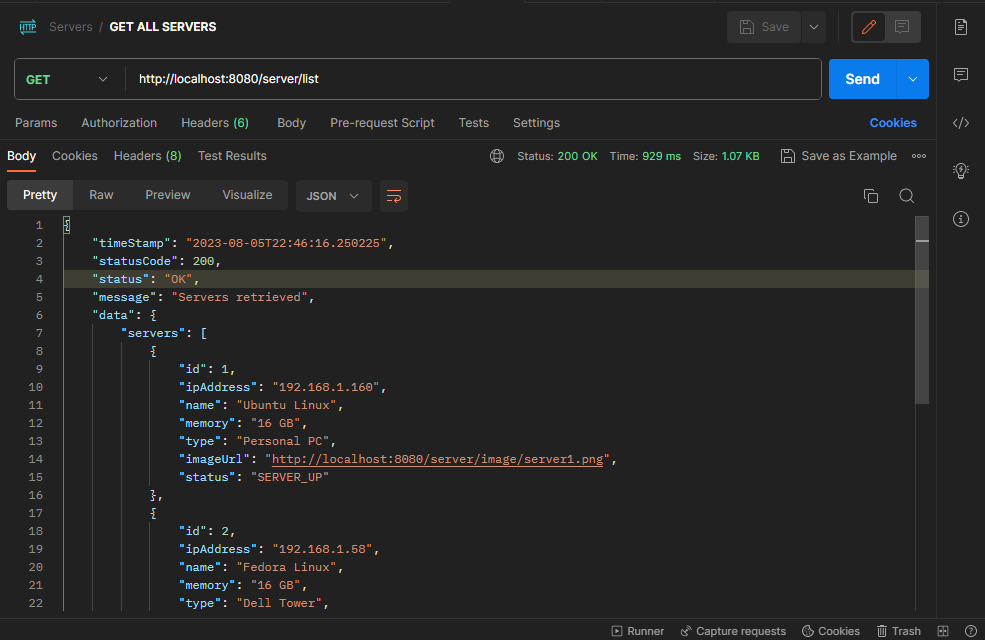
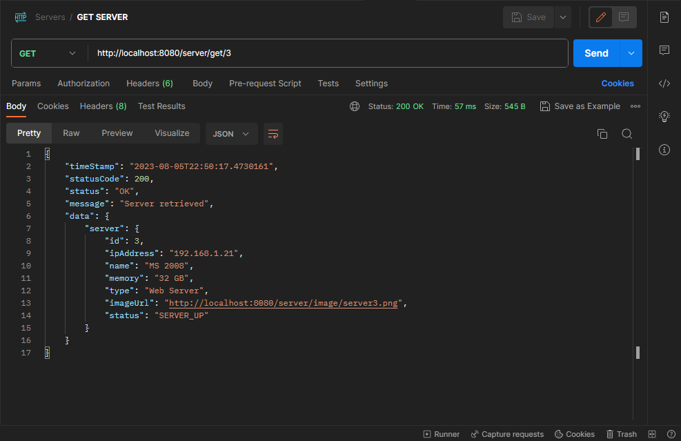
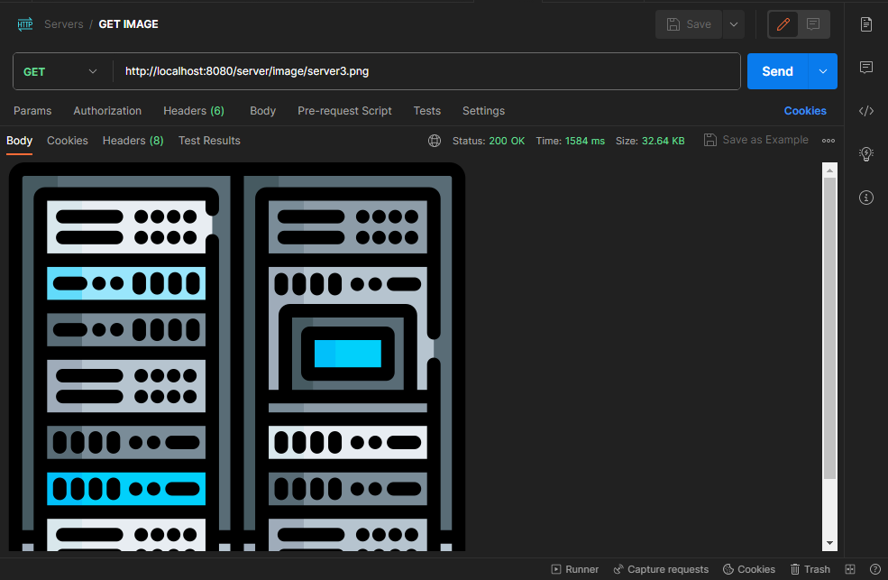
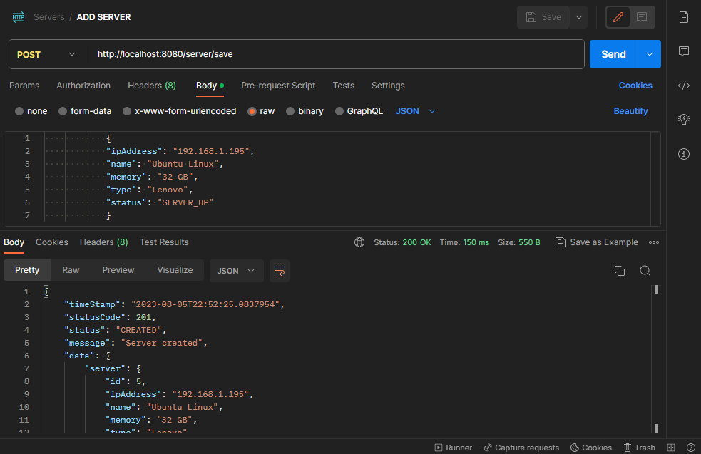
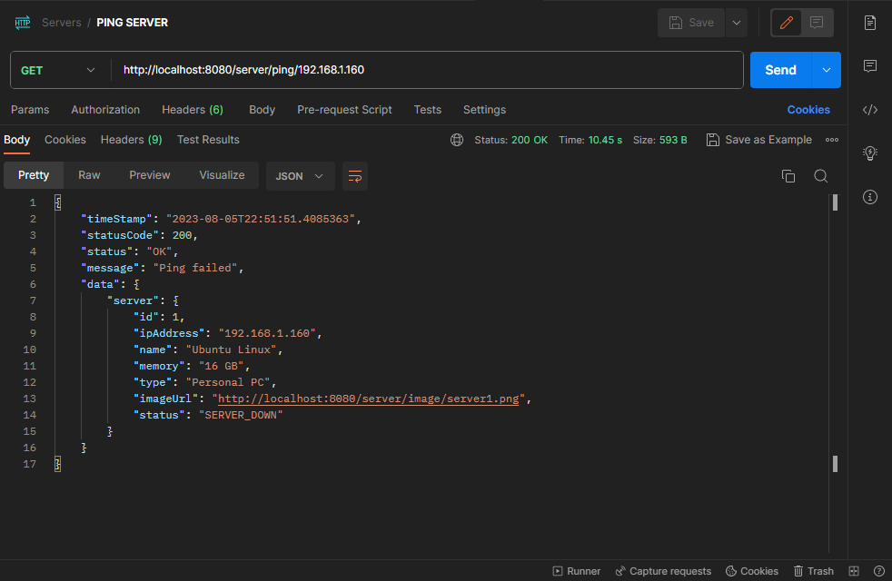

# Front-end repository: 
<a href="https://github.com/CassRamos/server_app_frontend" target="_blank"> Click here to check out the Angular front-end of this project</a>
 
 

<h1 align="center"> Server Manager </h1>

  <a href="#-tecnologies">Tecnologies</a>&nbsp;&nbsp;&nbsp;|&nbsp;&nbsp;&nbsp;
  <a href="#-project">Project</a>&nbsp;&nbsp;&nbsp;|&nbsp;&nbsp;&nbsp;
  <a href="#memo-license">License</a>
  

  

This repository is a back-end file of server_app application 

 

### Front-end is not running:

 If you don't run the front-end, nothing will be rendered on your localhost: 

 

## 🚀 Tecnologies

This project was developed with the following technologies:

- Java & Spring Boot 🍃
- MySQL 🐬
- Postman 
- Git & Github 

  

## 💻 Project

This project is responsible for promoting an server management interface, with basic functions create, edit, delete (CRUD) & ping functionality.

 

## :memo: License

This project is under license from MIT

 

## Endpoints 

To test the application endpoints you can use the Postman, HttpPie, Insomnia...

 

### Get all servers
 - 
 To fetch all data, you'll use: 

  

 

### Get server by id
 - 
 To fetch data from a specific server , you'll use the following endpoint by passing the server id: 

  

 

### Get image of server
 - 
 To fetch a server image, you'll use the following endpoint by passing the server image: 

  

 

### Create server
 - 
 To create a server in database, you'll use the JSON format and the endoint below 

  

 

### Ping server
 - 
 To perform the ping method on a single server, you will use the following endpoint, when that server does not send a response the status defined is DOWN, if the response is sent the status defined is UP 

  

  

Thanks for your attention, see you next time 💜

